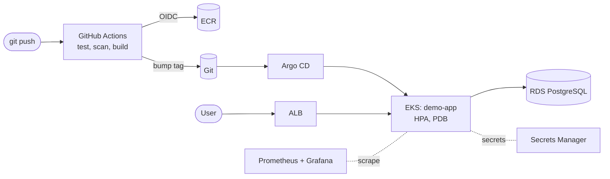

# Production-Style EKS Platform on AWS

[](https://github.com/Pavanreddy56/eks-platform/actions/workflows/ci.yml)
[](https://github.com/Pavanreddy56/eks-platform/actions/workflows/cd.yml)

An end-to-end AWS platform built the way a small platform team would build it:
infrastructure as code with Terraform, Kubernetes on Amazon EKS, GitOps delivery
with Argo CD, security scanning in CI, secrets from AWS Secrets Manager, and
Prometheus/Grafana observability with alerts and a runbook.



Full diagram and design decisions: [docs/architecture.md](docs/architecture.md)

## What this project demonstrates

| Area | Implementation |
|------|----------------|
| **Infrastructure as Code** | Terraform with reusable modules (network, EKS, RDS, ECR, GitHub OIDC, Pod Identity), S3 remote state with native locking, exact version pins |
| **AWS networking** | VPC across 2 AZs with public, private and isolated database subnets, NAT gateway, VPC flow logs, locked-down default security group |
| **Kubernetes (EKS)** | Managed node group on Spot, EKS add-ons, access entries, Pod Identity, AWS Load Balancer Controller (ALB Ingress), metrics-server |
| **Workload reliability** | Rolling updates with zero unavailability, startup/liveness/readiness probes, HPA, PodDisruptionBudget, zone spread |
| **GitOps** | Argo CD app-of-apps with sync waves, automated sync, self-heal and pruning |
| **CI/CD** | GitHub Actions: lint, unit tests, `terraform validate`, Helm lint, kubeconform schema checks, image build, deploy by Git commit |
| **DevSecOps** | Checkov and Trivy (IaC, Kubernetes manifests, container image) gates; OIDC instead of stored AWS keys; actions pinned to commit SHAs; non-root, read-only containers |
| **Secrets** | Credentials generated by Terraform, stored in Secrets Manager, synced into Kubernetes by External Secrets Operator |
| **Observability** | kube-prometheus-stack, ServiceMonitor, custom alert rules, Grafana golden-signals dashboard, [runbook](docs/runbook.md) |
| **Incident practice** | Game-day failure exercise with a blameless [RCA](docs/rca/) |
| **FinOps** | Cost-allocation tags, AWS Budget alerts, Spot, single NAT, EKS standard-support policy, ECR lifecycle ([docs/cost.md](docs/cost.md)) |

## Repository layout

```
.
├── app/                    FastAPI service (metrics, probes, PostgreSQL), Dockerfile, tests
├── helm/demo-app/          Helm chart: Deployment, HPA, PDB, Ingress, ExternalSecret, monitoring
├── gitops/
│   ├── bootstrap/          Argo CD install values
│   ├── root-app.yaml       App-of-apps entry point
│   └── apps/               Argo CD Applications (add-ons + demo-app)
├── terraform/
│   ├── bootstrap/          S3 bucket for Terraform state (run once)
│   ├── modules/            network, eks, rds, ecr, github-oidc, pod-identity
│   └── envs/dev/           Dev environment composition
├── scripts/                configure, Argo CD bootstrap, ordered teardown
├── docs/                   Architecture, runbook, cost, RCAs
└── .github/workflows/      ci.yml, cd.yml
```

## Prerequisites

- An AWS account and the AWS CLI configured (`aws sts get-caller-identity` works)
- Terraform >= 1.10, kubectl, Helm 3+, Git, Make
- A public GitHub repository for this code (Argo CD reads it anonymously)

> **Cost warning:** this creates billable resources (EKS, NAT gateway, RDS,
> ALB). Expect very roughly USD 0.25 to 0.40 per hour. Run `make destroy` when
> you are finished. See [docs/cost.md](docs/cost.md).

## Deploy it

**1. Point the manifests at your fork**

```bash
./scripts/configure.sh <your-github-username>     # optional 2nd arg: AWS region
git commit -am "chore: configure repository" && git push
```

**2. Create the Terraform state bucket (once)**

```bash
make bootstrap
```

**3. Create the infrastructure (about 15 to 20 minutes)**

```bash
cp terraform/envs/dev/terraform.tfvars.example terraform/envs/dev/terraform.tfvars
# edit: owner, github_repo, cluster_endpoint_public_access_cidrs (your IP /32)
make init plan apply
```

**4. Connect GitHub Actions to AWS**

In GitHub: *Settings > Secrets and variables > Actions > Variables*, add:

| Variable | Value |
|----------|-------|
| `AWS_ROLE_ARN` | `terraform -chdir=terraform/envs/dev output -raw github_actions_role_arn` |
| `AWS_REGION` | `ap-south-1` (or your region) |

Then run *Actions > CD > Run workflow*. It builds, scans and pushes the image,
and commits the image tag to `helm/demo-app/values-dev.yaml`.

**5. Install Argo CD; it deploys everything else**

```bash
git pull                      # fetch the image-tag commit from CD
make kubeconfig
make argocd
kubectl -n argocd get applications -w     # wait for all to be Synced/Healthy
```

**6. Use it**

```bash
make app-url                                   # public ALB URL (allow 2-3 min for DNS)
curl "$(make -s app-url)/"
curl -X POST "$(make -s app-url)/api/visits"   # writes to RDS
make grafana-password && make grafana-ui       # http://localhost:3000
make argocd-password  && make argocd-ui        # https://localhost:8080
```

Watch the HPA react to load:

```bash
kubectl -n demo run load --rm -it --image=busybox:1.37 --restart=Never -- \
  /bin/sh -c "while true; do wget -q -O- http://demo-app.demo.svc/ >/dev/null; done"
kubectl -n demo get hpa -w        # in another terminal
```

**7. Tear down**

```bash
make destroy
```

The script deletes the Ingress first so the controller removes the ALB, then
runs `terraform destroy`.

## How a change ships

1. Push a change under `app/` to `main`.
2. **CI** runs tests, linting, Terraform validation, Helm checks, Checkov and Trivy.
3. **CD** assumes an AWS role through OIDC, builds the image, blocks on fixable
   CRITICAL vulnerabilities, pushes to ECR with an immutable SHA tag, and
   commits the new tag to Git.
4. **Argo CD** detects the commit and performs a zero-downtime rolling update.
5. Roll back with `git revert`.

## Security highlights

- No long-lived AWS keys anywhere: GitHub OIDC for CI, EKS Pod Identity for
  add-ons, IMDS hop limit 1 so pods cannot use node credentials.
- Least-privilege IAM: the CI role can push to one ECR repository from `main`
  only; External Secrets can read one secret.
- Containers run as non-root with a read-only root filesystem, all Linux
  capabilities dropped and the RuntimeDefault seccomp profile.
- RDS: private subnets only, encrypted storage, TLS enforced (`rds.force_ssl`),
  ingress restricted to the node security group.
- Checkov and Trivy run on every push; accepted findings are documented inline
  with a justification.

## Run checks locally

```bash
make test                                      # ruff + pytest
make lint                                      # terraform fmt + helm lint
checkov -d . --config-file .checkov.yaml
trivy config .
```

## Roadmap

- [ ] TLS on the ALB with ACM and Route 53 (ExternalDNS)
- [ ] Argo Rollouts canary releases with Prometheus analysis
- [ ] Karpenter for Spot-aware autoscaling
- [ ] Terraform plan on pull requests via a read-only OIDC role
- [ ] Secrets Manager rotation for the database password
- [ ] Staging/prod environments with Terragrunt

## License

MIT
