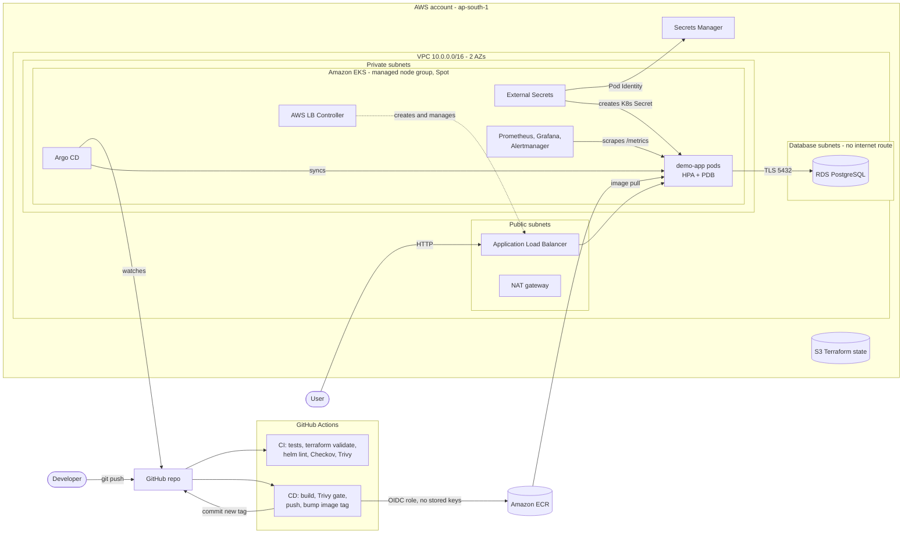

# Architecture

## Overview

## Request path

A user request reaches the internet-facing ALB in the public subnets. The ALB
forwards directly to pod IPs (`target-type: ip`) in the private subnets. Pods
reach PostgreSQL in isolated database subnets over TLS; the database security
group only accepts traffic from the node security group.

## Delivery path (GitOps)

1. A push to `main` that touches `app/` triggers the CD workflow.
2. The workflow assumes an AWS role through GitHub OIDC. The role can push to
   one ECR repository, and only from the `main` branch of this repository.
3. The image is built, scanned by Trivy (fixable CRITICAL vulnerabilities fail
   the job), pushed with an immutable tag (the commit SHA), and the tag is
   committed to `helm/demo-app/values-dev.yaml`.
4. Argo CD detects the commit and performs a rolling update
   (`maxUnavailable: 0`), gated by readiness probes.

The pipeline never holds cluster credentials. Git is the single source of
truth, and rolling back is a `git revert`.

## Platform bootstrap order

Argo CD applications use sync waves, and Argo CD is configured to report
child-application health, so add-ons install before workloads that need
their CRDs:

| Wave | Applications |
|-----:|--------------|
| -2 | metrics-server, aws-load-balancer-controller, external-secrets |
| -1 | kube-prometheus-stack |
|  0 | demo-app |

## Identity and access

| Workload | Mechanism | Permissions |
|----------|-----------|-------------|
| GitHub Actions | OIDC federation | Push to one ECR repo, `main` branch only |
| External Secrets Operator | EKS Pod Identity | Read one Secrets Manager secret |
| AWS Load Balancer Controller | EKS Pod Identity | Official upstream policy |
| Terraform operator | EKS access entry | Cluster admin (creator) |

Nodes keep IMDSv2 with a hop limit of 1, so pods cannot borrow the node's
IAM role through the instance metadata service.

## Key design decisions

| Decision | Why | Trade-off |
|----------|-----|-----------|
| Single NAT gateway | Saves roughly the cost of one NAT per extra AZ | NAT is a single point of failure for egress |
| Spot nodes, 4 instance types | Large saving for dev; multiple types reduce interruption risk | Nodes can be reclaimed with 2 minutes' notice |
| S3-native state locking | No DynamoDB table to manage (Terraform 1.10+) | Requires a recent Terraform |
| Pod Identity over IRSA | No OIDC provider per cluster; simpler trust policies | EKS-specific |
| ALB via LB Controller | AWS-native ingress, pod-IP targets | Ties ingress to AWS |
| Prometheus without persistent volumes | No EBS CSI driver needed in dev | Metrics reset when the pod restarts |
| Upstream registry modules, exact pins | Battle-tested VPC/EKS code; reproducible plans | Less control than hand-written modules |
